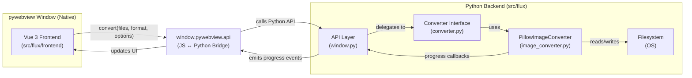

# Flux — Architecture

## System Layers & Data Flow



## API Surface (Exposed to Frontend)

| Method | Arguments | Returns | Errors |
|--------|-----------|---------|--------|
| `convert` | `{ files: { name, size, type, path }[], targetFormat: string, options?: { outputDir: string } }` | `{ jobId: string }` | `VALIDATION_ERROR`, `UNSUPPORTED_FORMAT` |
| `getProgress` | `{ jobId: string }` | `{ status: 'pending'\|'running'\|'complete'\|'error', progress: 0-100, outputPaths?: string[], error?: string }` | `NOT_FOUND` |
| `cancel` | `{ jobId: string }` | `{ cancelled: boolean }` | `NOT_FOUND`, `ALREADY_COMPLETE` |
| `getSupportedFormats` | — | `{ input: string[], output: string[] }` | — |
| `pickFiles` | `{ multiple?: boolean }` | `{ paths: string[] }` | `CANCELLED` |
| `pickOutputDir` | — | `{ path: string }` | `CANCELLED` |
| `openOutputDir` | `{ path: string }` | `{ opened: boolean }` | `VALIDATION_ERROR`, `OPEN_ERROR` |
| `getFilePreview` | `{ path: string }` | `{ dataUrl: string }` | `VALIDATION_ERROR` |
| `checkForUpdate` | — | `{ available, currentVersion, latestVersion, notes, publishedAt, assetName, assetSize }` | `NETWORK_ERROR`, `NO_RELEASES`, `BAD_RESPONSE` |
| `downloadUpdate` | — | `{ started: boolean }` | `NO_UPDATE` |
| `installUpdate` | — | `{ installing: boolean }` | `NOT_DOWNLOADED`, `INSTALL_ERROR` |

**Error shape**: `{ code: string, message: string, details?: object }`

### Dialog results

`create_file_dialog` does not return a consistent type: the WinForms backend
returns a bare string for a single-select OPEN dialog, a tuple of paths for a
multi-select one, and a single-element tuple for FOLDER - the folder dialog is
a re-purposed `OpenFileDialog` whose `FileNames` list is re-wrapped
(`webview/platforms/winforms.py`, `OpenFolderDialog.show`). Selections are
therefore normalized (`_dialog_paths` / `_first_path`) instead of stringified:
`str()` on the tuple stores repr text (`"('C:\\dir',)"`, separators doubled),
which no filesystem call accepts and which made every conversion fail with
`The output directory does not exist`. The frontend applies the same
normalization (`normalizeDirPath`) to what the picker returns and to the value
it reads back from `localStorage`, so a directory persisted in the unusable
shape by an earlier build is migrated instead of re-used.

### Dropped files

A native drop reaches the page as File objects only - the paths of the dropped
files live in WebView2's `CoreWebView2File` additional objects, which pywebview
hands to Python exclusively while a Python-side DOM drop listener is registered
(`FluxAPI.attach_drop_listener`). The page therefore renders dropped rows with a
blob-URL thumbnail and no path, and Python pushes the real paths back as a
`flux-dropped-paths` CustomEvent (`{ detail: { files: [{ name, path, size }] } }`)
once the drop lands, at which point the row is enriched and its preview is
re-fetched as a data URL. Nothing about this flow can be primed from JavaScript:
a JS-side bridge call cannot populate pywebview's drop state.

### In-app updates

The header's bell button (`UpdateBell`) surfaces newer GitHub releases: a
tiny yellow "!" badge appears when `checkForUpdate` (run once at startup,
after the bridge is ready) reports a release newer than `flux.__version__`,
and the popover offers **Download update**, **Dismiss** (session-only) and
**Mark as read** (persists the seen version in `localStorage` under
`flux-seen-release`). The only runtime network calls the app makes are this
check and the user-initiated download.

Every release (built by `.github/workflows/release.yml` on each `v*` tag)
carries two Windows artifacts: the portable `flux.exe` and the Inno Setup
installer `flux-setup-<ver>.exe`. The updater downloads the **installer** -
`pick_setup_asset` refuses to fall back to the portable exe - into the OS
temp dir (`flux-update/`), streamed in chunks to a `.part` file that is
renamed only when complete. Python pushes `flux-update-progress`
CustomEvents (`{ phase: 'downloading' | 'downloaded' | 'error', progress,
received?, total?, message? }`) exactly like `flux-progress`.

Applying an update is an explicit **Restart & update** action:
`installUpdate` launches the downloaded setup with `/SILENT` (per-user
install, `PrivilegesRequired=lowest`, so no UAC prompt) and then destroys
the window. The setup replaces the app's files and relaunches it (see the
`[Run]` entries in `installer/flux.iss`), completing the upgrade to whatever
version the release carried.

## Threading & Progress Reporting

- **UI thread**: pywebview main loop + Vue frontend (single-threaded JS)
- **Conversion thread**: Each `convert` call spawns a `threading.Thread` running the converter
- **Progress channel**: Converter accepts a `progress_cb(current, total)` callable; backend pushes updates via `window.evaluate_js()` to a Vue-side event bus
- **Job registry**: In-memory dict `jobId → { thread, converter, status, progress, outputPaths, error }`; cleaned up on completion or explicit cancel
- **Cancellation**: Cooperative — converter checks a `threading.Event` flag between files/operations

## Converter Interface (Extensible for Phase 2)

```python
# src/flux/converter.py
from abc import ABC, abstractmethod
from dataclasses import dataclass
from typing import Callable, Optional

@dataclass
class ConversionResult:
    output_paths: list[str]
    errors: list[str]

class BaseConverter(ABC):
    @property
    @abstractmethod
    def supported_input_formats(self) -> list[str]: ...

    @property
    @abstractmethod
    def supported_output_formats(self) -> list[str]: ...

    @abstractmethod
    def convert(
        self,
        input_paths: list[str],
        output_dir: str,
        target_format: str,
        options: dict,
        progress_cb: Callable[[int, int], None],
        cancel_event: threading.Event,
    ) -> ConversionResult: ...
```

- **Phase 1**: `PillowImageConverter` implements `BaseConverter`
- **Phase 2**: `FFmpegVideoConverter` will implement same interface; frontend contract unchanged
- **Registry**: `ConverterRegistry` maps format → converter instance; `get_converter_for_format()` selects at runtime

## Folder Structure

```
flux/
├── docs/
│   ├── PRD.md
│   ├── timeline.md
│   ├── ARCHITECTURE.md
│   └── DECISIONS.md
├── .github/
│   └── workflows/
│       ├── test.yml              # CI: pytest, frontend, CSS, installer checks
│       └── release.yml           # tag-driven release pipeline
├── installer/
│   └── flux.iss                  # Inno Setup script (dist/flux.exe → setup)
├── src/
│   └── flux/
│       ├── __init__.py           # __version__ (runtime version source)
│       ├── main.py               # pywebview entry point + --version/--help
│       ├── window.py             # API exposure + JS bridge
│       ├── converter.py          # BaseConverter ABC + registry
│       ├── services/
│       │   ├── image_converter.py  # PillowImageConverter
│       │   └── updater.py         # GitHub release check + installer download
│       ├── assets/                 # favicons, logos
│       └── frontend/               # Vue 3 + Tailwind (vendored)
│           ├── index.html
│           ├── src/
│           │   ├── main.js
│           │   ├── App.vue
│           │   ├── components/
│           │   ├── composables/
│           │   └── styles/
│           └── dist/               # built output (committed)
├── scripts/
│   └── check-frontend.js         # node syntax/template/index checks (no deps)
├── tests/                        # pytest suite (version + updater)
├── flux.spec                     # PyInstaller spec (dist/flux.exe)
├── pyproject.toml
├── uv.lock
├── .python-version
├── README.md
└── .gitignore
```

## Offline Constraints

- **No CDN**: Vue 3, Tailwind, and all dependencies vendored in `src/flux/frontend/`
- **Tailwind**: Compiled via standalone CLI (`npx tailwindcss -i ... -o ...`) at build time; no Node runtime in packaged app
- **Vue**: Pre-built `dist/` committed; `main.py` loads `file://` path to `dist/index.html`
- **Python deps**: Resolved via `uv` + `uv.lock`; PyInstaller bundles entire `.venv` site-packages
- **Assets**: All icons, logos, fonts embedded in PyInstaller bundle
- **ffmpeg (Phase 2)**: Static binary bundled alongside executable; no system dependency

## Frontend Design Plan

### Color Tokens (CSS Variables)

**Light Theme** (`:root`):
- `--color-bg: #FAFAFA`
- `--color-surface: #FFFFFF`
- `--color-surface-2: #F4F4F5`
- `--color-border: #E4E4E7`
- `--color-text: #0B0B0D`
- `--color-muted: #52525B`
- `--color-accent: #DC143C`
- `--color-accent-hover: #B8102F`
- `--color-accent-active: #970D26`
- `--color-accent-tint: rgba(220, 20, 60, 0.12)`
- `--color-success: #22C55E`

**Dark Theme** (`.dark`):
- `--color-bg: #0B0B0D`
- `--color-surface: #141417`
- `--color-surface-2: #1C1C21`
- `--color-border: #2A2A30`
- `--color-text: #F4F4F5`
- `--color-muted: #A1A1AA`
- `--color-accent: #DC143C`
- `--color-accent-hover: #B8102F`
- `--color-accent-active: #970D26`
- `--color-accent-tint: rgba(220, 20, 60, 0.12)`
- `--color-success: #22C55E`

**Semantic Tailwind Classes** (mapped in tailwind.config.js):
- `bg-surface`, `bg-surface-2`, `bg-bg`
- `text-fg`, `text-muted`
- `border-line`
- `bg-accent`, `text-on-accent`
- `focus-ring-accent`

### Typography

- **Font Family**: Inter (bundled locally) with system-ui fallback
- **Base Size**: 14px (0.875rem)
- **Scale**: 
  - `text-xs` (12px) — metadata, file sizes
  - `text-sm` (14px) — body, labels, buttons
  - `text-base` (16px) — emphasized text
  - `text-lg` (18px) — section headings
  - `text-xl` (20px) — wordmark
- **Weights**: 400 (regular), 500 (medium), 600 (semibold), 700 (bold)

### Layout Concept

- **Window**: ~900×600, resizable, min-width 640px
- **Structure**: Single column, top-to-bottom flow
  1. **Header** (56px): "Flux" wordmark (accent color, semibold) left; ThemeToggle + Settings icon right
  2. **DropZone** (flex-1, min 200px): Dashed border, centered content, crimson tint on drag-over, primary "Select files" button
  3. **FileList** (flex-1, scrollable): Table-like rows, each with filename, size, FormatSelect, status badge, ProgressBar, remove button
  4. **Footer** (72px): "Convert all" (primary), "Open output folder" (ghost), output folder selector, "Clear completed"

### State Coverage

| Component | Empty | Loading | Error | Success |
|-----------|-------|---------|-------|---------|
| DropZone | ✓ Drop prompt | — | — | — |
| FileList | ✓ "No files added" | — | — | ✓ "All converted" |
| FileRow | — | ✓ Spinner in status | ✓ Crimson badge + message | ✓ Green badge + path |
| ProgressBar | — | ✓ Animated | ✓ Crimson (error) | ✓ Green (complete) |
| Footer | — | ✓ "Converting..." | ✓ Disabled primary | ✓ "Converted" |

### Transitions & Motion

- 150ms `transition-colors` for hover/focus/active states
- 200ms `transition-opacity` for theme toggle
- `@media (prefers-reduced-motion: reduce)` disables all animations
- No heavy animations; only color/opacity transitions

### Accessibility

- AA contrast in both themes (verified: text 4.5:1, large text 3:1)
- Visible crimson focus rings (`focus-visible: ring-2 ring-accent`)
- Keyboard accessible: all interactive elements reachable and operable
- ARIA labels on icon-only buttons (ThemeToggle, remove, settings)
- Semantic HTML structure